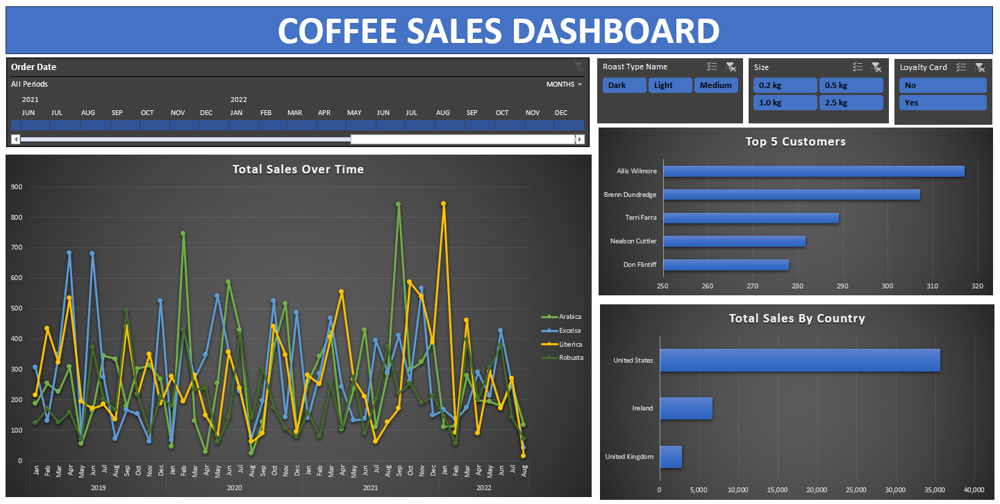

# ☕ Coffee Sales Dashboard (Excel)

This project is an interactive **Excel dashboard** built to analyze global coffee sales across multiple years.  
It includes dynamic filters, a timeline, trend analysis, and visual summaries of top customers and best-performing countries.  
All data cleaning was done manually in Excel.

---

## 📸 Dashboard Preview

---

## 📂 Project Files

- **coffeeSales_dashboard.xlsx** – Final interactive dashboard  
- Contains preview images used in README  

---

## 🔧 Data Preparation (Manual Cleaning)

The raw data required cleaning before visualization, so the following steps were completed manually in Excel:

- Removed duplicates and empty rows  
- Corrected inconsistent text values (countries, roast names, etc.)  
- Fixed date formats and number formats  
- Merged multiple sheets into a single well-structured table  
- Applied proper data types for analysis  
- Prepared the final dataset for PivotTables, PivotCharts, slicers, and timeline

No Power Query or automation tools were used.

---

## 📊 Dashboard Features

### **1. Sales Timeline (Order Date)**
A dynamic timeline allows filtering across:
- Years  
- Months  
- Custom date ranges  

### **2. Total Sales Over Time (Line Chart)**
Compares monthly sales trends for:
- Arabica  
- Excelsa  
- Liberica  
- Robusta  

### **3. Slicers**
Interactive slicers filter the entire dashboard by:
- Roast Type (Dark, Light, Medium)  
- Package Size (0.2 kg, 0.5 kg, 1.0 kg, 2.5 kg)  
- Loyalty Card (Yes / No)

### **4. Top 5 Customers**
A bar chart showing the highest-spending customers.

### **5. Total Sales by Country**
Highlights which countries contribute the most to coffee sales:
- United States  
- Ireland  
- United Kingdom  
(and others if filtered)

---

## 💡 Insights (From Visuals)

- The United States is the most significant sales market.  
- Sales show noticeable seasonal variation across years.  
- Customer purchasing power varies widely, with a few customers driving most sales.  
- Coffee types exhibit different peak months, helping identify demand patterns.

---

## 🛠 Tools Used

- Microsoft Excel  
  - PivotTables  
  - PivotCharts  
  - Slicers  
  - Timeline  
  - Manual data cleaning  
  - Chart formatting & layout design

---

## 📥 Download the Dashboard

Click the file in this repository to download:  
**coffeeSales_dashboard.xlsx**

---

## 📘 How to Use

1. Open the Excel dashboard  
2. Use the timeline to browse across years/months  
3. Adjust slicers to filter by roast type, package size, or loyalty card status  
4. Explore changes across coffee types, customers, and countries  

---

